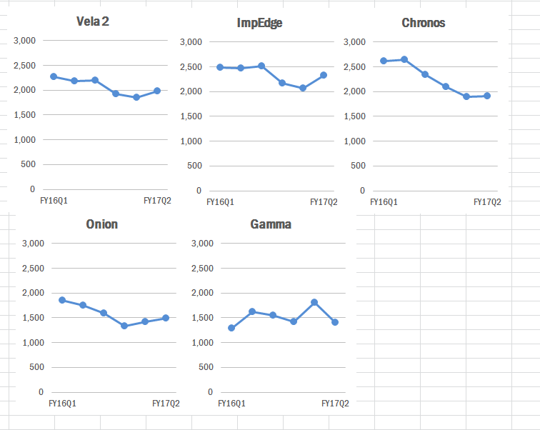

# SHOW ME THE NUMBERS: DESIGNING YOUR OWN DATA VISUALIZATIONS
PEPFAR Applied Learning Summit | September 2017 | A. Chafetz | USAID

## MATERIAL 

  
 https://docs.google.com/presentation/d/e/2PACX-1vQ-vBKLVhkdW7aF-iruxcZRzja4WvRFcBfGXjQCftLD-w6u9Z3EgtiwMs80PRbVdYKwa7u0D5ECy_D3/pub?start=false&loop=false&delayms=3000
 
  
 https://drive.google.com/uc?export=download&id=0B0kWHKt_xDVYbklPNERXcmRlLXc    

## EXERCISE 
**Exercise Overview**

In order to prepare for the upcoming POART, you need to look into testing as this was a potential issue brought up on the previous POART. There are a number of testing implementing mechanisms (IMs) working in PEPFARlandia. Rather than looking across all mechanisms, you have narrowed your scope down to the five IMs with the largest targets for FY17.  Your goal is to create a visualization that shows these mechanisms (a) FY17 cumulative achievement against targets and (b) their trend the last six quarters.

**Accessing the Data**

To answer this question, you have accessed ICPI’s most recent IM Fact View file for PEPEFARlandia. Since the file is quite large, someone in your office has already subset the dataset to just contain HTS_POS and TX_NEW indicator data for Total Numerator and the MCAD age disaggregations. The file is saved in a txt format, meaning you will need to import it into Excel. To do so, open a new Excel window, and in the Data tab of the ribbon, select From Text and browse to your file. Once you have the Text Import Wizard open, just hit Finish and then OK.

**Subsetting the Data of Interest**

Now that you have the data imported into Excel, you can start crafting it to whittle it down to just the data you need. The data is currently in long form and you need to get into a usable table, selecting just some of the information and grouping and aggregating it by partner. This can be done through formulas in Excel, which can allow more flexibility; you have a quick turnaround time so you decided to pull this together via pivot table.

To create the pivot table, you will need to select a cell, such as A1, in the sheet where your data is stored.  Once the cell is selected, you can go up to the Insert tab in the ribbon, select PivotTable and then hit OK in the popup screen.

Now you can start slicing and dicing your data. To start off with, you add a few key components to the Report Filter field: indicator, standardizeddisaggregate, and is mcad. For each you need to select HTS_POS, Total Numerator, and N, respectively to restrict what will end up populating in your table.

Time to add in your Row Labels, i.e. your unit of analysis, – implementingmechanismname – since you want to be comparing the IMs.

Lastly, you will need to add the time periods you’re looking at, FY16Q1-FY17Q2 as well as the FY17 targets to the Values area of the pivot table. 

You’ll notice that the values are all counts (i.e. the number of rows in the dataset for that IM and period). Instead, you need the sum. To change this, select a cell in the first value column of the pivot table, go to the Options tab of the Ribbon and change the Summarize Value By to Sum. You’ll need to repeat this process for each value column.

One additional feature you will want to add is the target achievement as a calculated item in the pivot table. To add this field, you will need to go up to the Options tab, click on Fields, Items, & Sets and then calculated field. In the popup window, you need to add a name, “achievement” as well as the calculation – “=(fy2017q1+fy2017q2 )/fy2017_targets”. Once you hit OK, the new field will be added to the pivot table.

        

Since you are interested in only the top mechanisms with the largest targets, you should to sort your targets column from high to low. To do this, you will right click on a value in the fy2017_targets column, scroll down to Sort and then sort the column from largest to smallest.

Perfect. Now you have all the data that you need to create your visualizations formatting into a nice table. Since it is easier to work with the graph outside of the pivot table, you will want to copy the data onto a new tab. Copy the header row and top five mechanism’s data into new tab

Since you were asked about achievement as well as trends, you decide you want to have two different kinds of chart and two tables.  Copy the first table in the tab and paste it below the first one.  You will use the top for the achievement graph so you can delete all the data except achievement (selecting all that data, right clicking to Delete, and then choosing Shift cells left), so that the mechanism names appear right next to the achievement data. In the second table, you delete the last two columns containing the targets and achievement. 

 

**Creating the Base Visualizations**

Time for some graphing! For the first graph, you will want to select the headers and data in the top table.  With the data selected head to the Insert tab of the Ribbon, click Bar and then 2-D Clustered Bar.

You will repeat this process with the bottom table, but this time select a 2-D Line with Markers.

**Improving Achievement [Graphs]**

Alright, so you have now graphed your visuals and could stop here, but there are lots of improvements you could make to craft a stronger and cleaner graph and message. You want to emphasize the achievement through color and size and cut out any extra lines or information that are not needed in chart, actively detracting from the focal point – your data. So, time to dig in, starting with the achievement graph. 

 

There is a lot of “chart junk” going on in this graph. Start with the easy stuff; remove the legend by clicking on it and then hitting delete.

Next, you decided to get rid of all the line and tick marks. To remove the gridlines, click on one of them and then hit delete.  Now to reformat the y-axis. Right click on the axis and select format. Under Axis Options, change Major tick mark type to None. 

While formatting the y-axis, you will also want to change the color to a lighter saturation so it is not as prominent. Under Line Color, change the radio button from Automatic to Solid line, and change it to “White, Background 1, Darker 25%” (the first column down, fourth from the top). Now you can close out of the y-axis formatting.

 

Next up, you will move onto the x-axis. You plan on directly labeling the bars, so there is no need to have the axis. But before you do, you are going to limit the view to 100% max.  Right click on the x-axis and select Format. Change the Maximum from Auto to Fixed at 1. You can close out of the formatting window and remove the x-axis, by selecting it and hitting delete.

 

Things are looking good, but it would be better to increase the size of the each of the bars’ widths so there is less white space and the bars are more prominent. Select one of the bars and right click to pull up the formatting. Once there, change the Gap Width from 150% to 50%.

Since you removed the x-axis, you will need to directly label the bars. To add a label, right click on one of the bars and select Add Data Labels. 

This adds data labels to the end of each bar; to make the achievement amount more readable, it would be great to format the numbers as a percentage and move the location to the base of the bars so they are all in line with each other. To reformat the number, select any of the data labels, right click and bring up the formatting tab. Change the Label Position to Inside Base. Next, under Number, change the Category to Percentage and the Decimal places to 0.

   

To better convey your message, you can color-code the bars so the audience can easily associate the percentage with where the partner should be at this point in the year.  To recolor a bar, double click on that bar so only it is selected. Using Fill Color (the paint bucket icon) in the Font section of the Home Ribbon, select More Colors. Under the Custom tab, change the Red, Green, Blue values to 255, 102, 0. 

 

Repeat this for the bar second to the bottom. For the middle bar, you will fill it with green (RBG - 44, 162, 95) and the top two bars are above 60% so you can fill them with a blue (RGB - 85, 142, 213). To make the values more readable, single click on any of the percentages. With the series selected, in the Font portion of the Home ribbon, change the color to white.

Only a couple more change to make! You want to remove the border so you right click on the chart and select Format Chart Area. Under Border Color, change it to No line. Close out of the window and click on the Chart Title, changing it to read “Achievement,” and reduce the font size to 16. And voila! You are done with the first visual.
 

**Small Multiples Approach to Line Graphs**

Line charts can be especially messy (and look like spaghetti) when there are quite a few lines being graphed. This can make the graph difficult to read. To clean things up in the initial line chart you created, you decided to break the visual into five separate graphs (called small multiples), one for each mechanism to clearly display the trends. To best approach this, you will want to format one graph exactly the way you want it to look and then copy it over, changing the underlying data.

Before you get started, you will want to reorder to mechanisms in the lower table so they end up being graphed in the same order as the bar chart you just created. You will notice that the bar chart values in the table are sorted low to high but when graphed go from high to low. The easiest way to reorder you table is to add a number from 1 to 5 in the cells adjacent to your table. Select the whole table and sort it from high to low based. Under the Data tab of the ribbon, select the sort that goes from High to Low.

To get started, you will want to delete all but one charted line in the graph, selecting each one and then hitting delete.

You will now go through a similar process cleaning up the base graph as you did in the bar chart. You will want to delete the legend again and deal with the axes. Start with the y-axis formatting, by selecting it, right clicking, and choosing format. In the format window, change the Major tick mark type to None. While you ae here, you will also want to adjust the scale of the axis manually so that every graph has the same max, min, and units. Looking at the data table, you see the max value is around 2,650, so you set the Maximum to 3,000, Minimum to 0, and Major Unit to 500. 

 

While formatting the y-axis, you also decide to remove the axis line (under Line Color, change it to No Line) and to make the numbers more legible, you add a comma for the thousands place (under Number, you select Number, change the Decimal places to 0, and check the Use 1000 Separator box.

 

Since you are keeping the gridlines, it is best to reduce the saturations so they are not as bold and do not stand out as much. Select one of the grid line, right click to format and change the Line Color to Solid Line;  change it to “White, Background 1, Darker 25%” (the first column down, fourth from the top). Now you can close out of the y-axis formatting.

 

For the next step, you will want to adjust the trend line and markers. Select the trend line and right click to format.  Under Marker Options, change the radio button from Automatic to Built-in and select the circle marker. You will also want to change the line and marker colors to a non-standard color. In the Marker Fill, Line Color, and Marker Line Color tabs, change to Solid fill/line and select the blue you used in the bar graph so they two match, making it easier to associate the mechanism’s trend and achievment. 

 

Time to tackle the x-axis. One issue you are seeing is that there is a lot of repetition in the labeling and quite a bit of text, most of which is unnecessary. To pair this down, you keep just the first and last text headers in the table, which will reflect in the graph, and relabel them to FY16Q1 and FY17Q2 to be concise and keep things tidy. 

 

With the labeling shortened, you now want to remove the ticks and dark line color on the x-axis by hiding the line entirely. Click on the x-axis and right click to format. Under Line Color, select No Line.

A handful of some small, clean-up items before you replicate your graph. First, select the graph and change the font color to a lighter shade of black. (Black, Text 1, Lighter 35%).  Second, change up the font to a non-default, using Franklin Gothic Medium Cond. 

 

Third, you do not need the border line around the graph as it’s just more chart junk and pulling focus from the graph. With the chart select, right click to format, and under Border Color, change it to No line. Fourth, the font for the title is bit large, so you reduce the size down to 14. And last but not least, you will want to reduce the size so you can fit a number of them together. With the chart selected, go to the Size section of the Format ribbon and cut the width in half, shrinking is to 2.5 inches.

 

Alright, now that you have your template graph, you will just need to copy the graph and change the data source. Select the graph, copy it, and paste it adjacent to the first one. With the graph selected, the data in the table should be highlighted. You can pull the blue outline around the data down to the second mechanism in the table which will automatically update the graph’s source and visual.

  

Repeat this process so that you have graphs for all five mechanisms in two rows, with the first row containing three mechanism and the second containing two.

  

You notice there is a lot of repetitive text in the graphs that are taking up space and take away focus. A way to tidy things up here would be to reduce the y-axis to just graphs on the right, and axis to the graphs on the bottom. If you delete the axes, the sizing with be different across the graphs. A work around would just to recolor the text you do not need to white and shift everything closer together. In graphs 1, 2, and 3 (counting going from left to right and then top to bottom), change the x-axis font color to white. For graphs 2, 3, and 5, change the font color of the y-axis to white.

  

Now that the text is reduced, it would be good to clean up the graphs by aligning them and bringing them closer together. Since you will be overlapping the graphs, you need to worry about the arrangement of the graphs (which graphs are on top of which). You need to start by selecting graph 2 and under the Format ribbon at the top, click on the drop down for Bring Forward and select Bring to Front. Repeat this process in for the graphs in the following order: 1, 5, 4. 

   

With the graphs reordered, you can drag the graphs closer together so they have on a slight visible gap between them. To ensure the graphs look tidy, you will want to ensure they are all aligned. Select graphs 1, 2, 3 (holding the shift key down while clicking on each graph). In the Format ribbon under Align, first select Distribute Horizontally to ensure equal spacing between each and then select Align Top.

  

The bottom graphs require a little more work. Start by selecting graphs 1 and 4. In the Format ribbon under Align, select Align Left. Repeat this process with graphs 2 and 5. Finally, select graphs 4 and 5 and under the Format ribbon, select Align Top. Drag graph 4 and 5 up so they are closer to the top line of graph, about the same distance as between graphs horizontally.  

  

For the very last thing, you will want to match each of the graphed line colors to their associated achievement color to connect the two visuals. You will need to repeat the process you went through earlier to change the Marker Fill, Line Color, and Marker Line Color. 

  
 

**Bringing it all together**

You now have the achievement graph and small multiples, it’s time to bring it all together. With the extra gap on the sixth quadrant of the line charts, you can reduce the size of the achievement graph and integrate it in with the rest of the visuals. 

Select the achievement graph. To start with, in the Format Ribbon, arrange this graph by bringing it to the front. Next, with the chart still selected, go to the Size section of the Format ribbon and reduce the width to 2.1 inches to fit the gap in the series. Drag the graph to the sixth quadrant and then select both graphs 5 and 6 and Align Top. Select graphs 3 and 6 and Align Left.

  
 

Almost there! The two missing pieces currently are a title and source. To add in a title, go to the Insert ribbon and select Text Box, drawing it above the top of the graphs reading - PEPFARlandia "largest target" mechanisms see lower FY17Q2 results than the same point in FY16. Increase the font to 16, change the font to Franklin Gothic Medium, change the font color to a lighter black, and remove the outline. In the same text box, also add the subtitle in size 14 font - Mechanisms with the largest testing targets for FY17. The last thing you need to do is add a source to the bottom of the graph. Insert a new text box to the bottom, changing the color to a lighter black, size 10, Franklin Gothic Medium text with the outline removed  - Source: PEPFAR ICPI Fact View IM SNU FY17Q2 Clean dataset.

